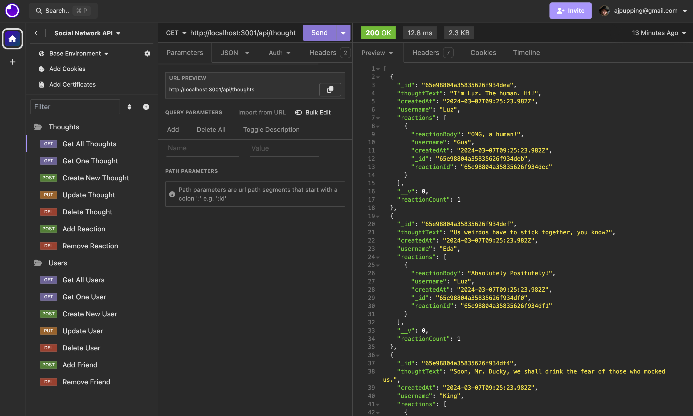

# Social Network API

## Description

The purpose of this project was to use Express and MongoDB to create a functioning social network API. Users can add their thoughts and react to another user's thoughts. They can update their username or email, and also update previously saved thoughts. Users can add or remove friends and thoughts or reactions. All of these features are essential to a social network application. 

## Installation

To install this application, first download the repository. Ensure you have MongoDB and Insomnia installed. 

Next, run the command npm run seed in the terminal, to seed the database with sample data. I used characters from The Owl House, for fun. You can insert your own data in seed.js if you wish. 

After that, run the command npm run start. The console log should indicate that the server is running in the local host. 

Finally, open Insomnia to view and interact with the database. 

## Usage

This application is equipped with GET, POST, PUT, and DELETE routes, which can be tested in Insomnia. 

Review the available routes in the userRoutes and thougthRoutes files. 

[Click here](https://drive.google.com/file/d/1qoeTD8JRCUYDt8X-vLwS10isqAf9dhrr/view?usp=sharing) to find a walkthrough video, showing the full functionality of the application. 

## Credits

I used [this guide](https://www.mongodb.com/developer/products/mongodb/seed-database-with-fake-data/) to learn more about seeding data with MongoDB.

## License

This project was created for educational purposes and does not have a license. 